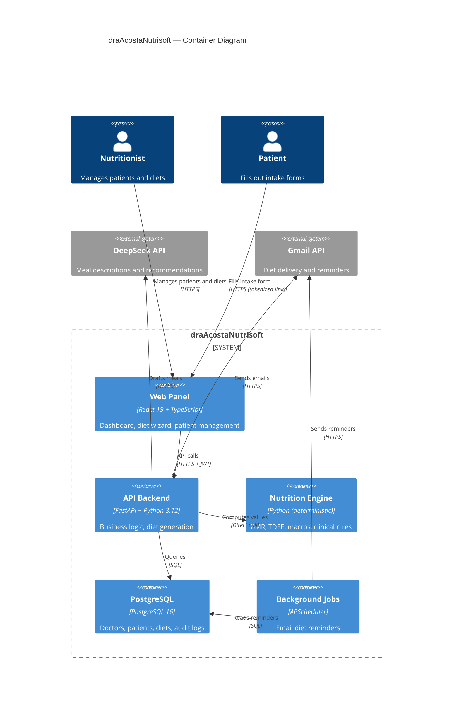

# 🥗 draAcostaNutrisoft

[](https://github.com/hrafael2011/draAcostaNutribot/actions/workflows/ci.yml)
[](https://www.python.org/)
[](https://fastapi.tiangolo.com/)
[](https://react.dev/)
[](https://www.typescriptlang.org/)
[](https://www.postgresql.org/)
[](LICENSE)

**Intelligent nutrition platform for professional clinics.** AI-assisted meal planning backed by a deterministic nutritional engine — clinical accuracy in every macro, professional PDF export, and a Telegram assistant for the doctor.

> **Value proposition:** The nutritionist focuses on the patient, not on calculations. The AI drafts meals; the deterministic engine guarantees clinical precision in every macronutrient.

---

## Table of Contents

- [Features](#features)
- [Tech Stack](#tech-stack)
- [Architecture](#architecture)
- [Demo](#demo)
- [Quick Start](#quick-start)
- [Project Structure](#project-structure)
- [API Endpoints](#api-endpoints)
- [Testing](#testing)
- [Environment Variables](#environment-variables)
- [Contributing](#contributing)
- [License](#license)

---

## Features

### 🧬 Deterministic Nutrition Engine
- ✅ BMR (Mifflin-St Jeor), TDEE, BMI, and macronutrient calculations
- ✅ 3 strategy modes: Auto, Guided, Manual
- ✅ Clinical rules per pathology: hypertension, type 2 diabetes, kidney disease, dyslipidemia
- ✅ Caloric safety floors (1200 kcal ♀ / 1500 kcal ♂)
- ✅ Engine schema versioning (`ENGINE_SCHEMA_VERSION = "1.0"`)

### 🤖 AI-Powered Diet Drafting
- ✅ OpenAI-compatible (DeepSeek) for meal descriptions and recommendations
- ✅ Engine + LLM merge: engine values **override** LLM output for clinical safety
- ✅ Macronutrient recalculation on manual meal edits
- ✅ Temperature 0.4 for generation, 0.2 for recalculation

### 📋 Complete Clinical Profiles
- ✅ Public intake form via tokenized link (registration & updates)
- ✅ Body metrics with time series (weight, body measurements)
- ✅ Activity profile, nutritional goal, restrictions, and pathologies
- ✅ Profile completeness check before diet generation

### 📄 Diet Export
- ✅ Professional PDF with WeasyPrint (automatic ReportLab fallback)
- ✅ Responsive HTML preview in browser
- ✅ Email delivery (Gmail API) with professional template

### 🔐 Clinical & Operational Security
- ✅ JWT + bcrypt + 3 RBAC roles (super_admin, admin, doctor)
- ✅ Force password change on first login
- ✅ Rate limiting on login (5/min) and forgot-password (2/10min)
- ✅ Circuit breaker for external APIs (50 × 5xx in 60s → 30s cooldown)
- ✅ Soft delete with recycle bin (patients & diets)
- ✅ Audit log for all clinical actions

### 🧙 10-Step Diet Generation Wizard
- ✅ Guided flow: patient selection → strategy → duration → meals → macros → review → confirmation
- ✅ Post-generation quick-adjust of meals
- ✅ Full versioning with input/output snapshots

---

## Tech Stack

| Layer | Technology | Version |
|-------|-----------|---------|
| **Backend** | FastAPI + Python | 3.12+ |
| **ORM** | SQLAlchemy 2 Async + Alembic | 2.0 |
| **Database** | PostgreSQL | 16 |
| **Frontend** | React + TypeScript + Vite | 19 / 5.7 / 7 |
| **State/Fetching** | @tanstack/react-query | 5 |
| **Styling** | Tailwind CSS 4 + Framer Motion | — |
| **AI** | DeepSeek (OpenAI-compatible) | — |
| **PDF** | WeasyPrint + ReportLab (fallback) | ≥68 / ≥4.2 |
| **Email** | Gmail API | — |
| **Testing** | pytest (backend), Vitest (frontend) | — |
| **Deploy** | Railway (backend) + Vercel (frontend) + Docker | — |

---

## Architecture



**Style:** Layered architecture with a rich domain model. The nutrition engine (`backend/app/nutrition/`) is 100% deterministic — it never delegates clinical calculations to an LLM. See [ADR-001](docs/adr/ADR-001-deterministic-engine-over-llm.md) for the rationale.

For a deeper dive, read [ARCHITECTURE.md](docs/ARCHITECTURE.md) (C4 diagrams, data flow, design patterns, ER model, and key decisions).

---

## Demo

> **🔗 Live demo:** https://draacostanutrisoft.vercel.app

| Role | Email | Password |
|------|-------|----------|
| Demo doctor | `demo@nutrisoft.com` | _Contact me for access_ |

> **Note:** The demo uses a staging environment with sanitized data. Contact [Hendrick Rafael](mailto:hendrick@example.com) for test credentials.

<!-- TODO: Add screenshots


-->

---

## Quick Start

### Prerequisites
- Docker and Docker Compose
- Node.js 20+
- Python 3.12+

### Local Development

```bash
# 1. Clone
git clone https://github.com/hrafael2011/draAcostaNutribot.git
cd diet_telegram_agent

# 2. Configure backend
cp backend/.env.example backend/.env
# Edit: DATABASE_URL, JWT_SECRET, OPENAI_API_KEY, OPENAI_MODEL, CORS_ORIGINS

# 3. Start PostgreSQL
docker compose up -d

# 4. Backend
cd backend
pip install -r requirements.txt
uvicorn app.main:app --reload --port 8001

# 5. Frontend (new terminal)
cd frontend
cp .env.example .env.local
npm install
npm run dev
```

Access:
- **Backend API:** `http://localhost:8001`
- **API Docs (Swagger):** `http://localhost:8001/docs`
- **Frontend:** `http://localhost:5173`

---

## Project Structure

```
diet_telegram_agent/
├── backend/
│   └── app/
│       ├── api/            # Route handlers (10 routers: auth, patients, diets, admin, dashboard...)
│       ├── core/           # Config, DB engine, security, circuit breaker, rate limiter
│       ├── logic/          # Domain rules: eligibility, duration, profile completeness
│       ├── nutrition/      # 🧬 Deterministic engine (the project's core)
│       │   ├── contract.py     # Immutable dataclasses: NutritionInput, NutritionResult
│       │   ├── engine.py       # BMR, TDEE, macros, safety floors
│       │   ├── clinical_rules.py  # Pathologies: renal, diabetes, hypertension, dyslipidemia
│       │   ├── input_builder.py   # Builds NutritionInput from ORM models
│       │   └── plan_merge.py      # Engine > LLM merge (engine values override)
│       ├── services/       # Diet generation, OpenAI, PDF export, email, reminders
│       ├── models.py       # 9 SQLAlchemy models
│       └── schemas.py      # ~35 Pydantic schemas
├── frontend/
│   └── src/
│       ├── pages/          # 16 pages (Dashboard, Patients, Diets, DietWizard...)
│       ├── components/     # UI library + 10-step wizard + diet preview + cards
│       ├── services/       # API client (~60 typed functions)
│       └── context/        # AuthContext, ToastContext
├── docs/
│   ├── ARCHITECTURE.md     # Deep architecture documentation
│   └── adr/               # Architecture Decision Records (3)
├── docker-compose.yml
├── railway.toml
└── DEPLOYMENT.md
```

---

## API Endpoints

| Method | Path | Description | Auth |
|--------|------|-------------|------|
| POST | `/api/auth/register` | Initial doctor registration | Public (blocked if doctor exists) |
| POST | `/api/auth/token` | Login (JWT) | Public |
| POST | `/api/auth/change-password` | Force password change | JWT |
| POST | `/api/auth/forgot-password` | Request password reset | Public |
| POST | `/api/auth/reset-password` | Execute password reset | Token |
| GET | `/api/patients` | List patients | JWT |
| POST | `/api/patients` | Create patient | JWT |
| GET | `/api/patients/{id}/profile` | Full clinical profile | JWT |
| POST | `/api/patients/{id}/metrics` | Log metrics | JWT |
| POST | `/api/diets/generate` | Generate diet with AI | JWT |
| GET | `/api/diets/{id}/pdf` | Export to PDF | JWT |
| POST | `/api/diets/{id}/email` | Send diet by email | JWT |
| POST | `/api/intake-links` | Create public intake form link | JWT |
| GET | `/api/dashboard/summary` | Dashboard KPIs | JWT |
| GET | `/api/health/ready` | Health check with DB | Public |

---

## Testing

| Type | Framework | Command |
|------|-----------|---------|
| Backend | pytest | `cd backend && pytest tests/ -v` |
| Nutrition engine | pytest | `cd backend && pytest tests/test_nutrition_*.py -v` |
| E2E generation | pytest | `cd backend && pytest tests/test_e2e_flow.py -v` |
| PDF export | pytest | `cd backend && pytest tests/test_diet_export_pdf.py -v` |
| Frontend | Vitest | `cd frontend && npx vitest run` |

Core coverage: **nutrition engine** (139 + 67 + 105 + 107 test lines), **E2E flow** (2,177 lines), and **PDF export** (176 lines).

---

## Environment Variables

### Backend (`backend/.env`)

| Variable | Required | Description | Default |
|----------|----------|-------------|---------|
| `DATABASE_URL` | ✅ | PostgreSQL connection string | `postgresql+asyncpg://...` |
| `JWT_SECRET` | ✅ | Secret key for JWT signing | — |
| `OPENAI_API_KEY` | ✅ | DeepSeek (OpenAI-compatible) API key | — |
| `OPENAI_MODEL` | ✅ | Model ID for diet generation | `deepseek-chat` |
| `CORS_ORIGINS` | ✅ | Allowed CORS origins (comma-separated) | `http://localhost:5173` |
| `TELEGRAM_BOT_TOKEN` | Use-case | Telegram bot token | — |
| `TELEGRAM_BOT_USERNAME` | Use-case | Telegram bot username | — |
| `TELEGRAM_WEBHOOK_SECRET` | Use-case | Webhook secret token | — |
| `GMAIL_API_CREDENTIALS` | Use-case | Gmail API service account JSON | — |
| `ENV` | — | Environment label | `development` |
| `RUN_MIGRATIONS` | — | Run Alembic migrations on boot | `1` |
| `LOG_LEVEL` | — | Logging level | `INFO` |

### Frontend (`frontend/.env.local`)

| Variable | Required | Description | Default |
|----------|----------|-------------|---------|
| `VITE_API_BASE_URL` | ✅ | Backend API base URL | `http://localhost:8001/api` |

---

## Contributing

Contributions are welcome! Please read [CONTRIBUTING.md](CONTRIBUTING.md) for development setup, coding standards, and the PR process.

---

## License

Distributed under the MIT License. See [LICENSE](LICENSE) for details.

---

<p align="center">
  Built with ❤️ by <a href="https://github.com/hrafael2011">Hendrick Rafael</a>
</p>
