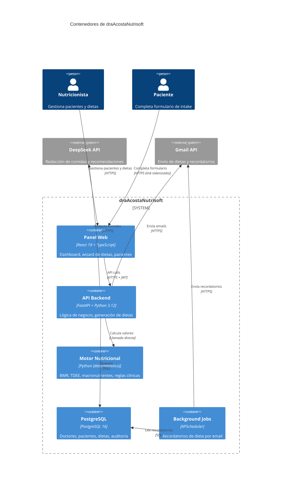

# 🥗 draAcostaNutrisoft

[](https://www.python.org/)
[](https://fastapi.tiangolo.com/)
[](https://react.dev/)
[](https://www.typescriptlang.org/)
[](https://www.postgresql.org/)
[](LICENSE)

**Plataforma nutricional inteligente para consultorios profesionales.** Perfiles clínicos completos, generación de dietas con IA asistida por un motor nutricional determinístico, panel administrativo web, y exportación a PDF profesional.

> **Propuesta de valor:** El nutricionista enfoca su tiempo en el paciente, no en hacer cálculos. La IA redacta las comidas; el motor determinístico garantiza precisión clínica en cada macronutriente.

---

## ✨ Features

### 🧬 Motor Nutricional Determinístico
- ✅ Cálculo de BMR (Mifflin-St Jeor), TDEE, IMC, y macronutrientes
- ✅ 3 modos de estrategia: Auto, Guiado, Manual
- ✅ Reglas clínicas por patología: hipertensión, diabetes tipo 2, enfermedad renal, dislipidemia
- ✅ Safety floors calóricos (1200 kcal ♀ / 1500 kcal ♂)
- ✅ Versionado de esquema del motor (`ENGINE_SCHEMA_VERSION = "1.0"`)

### 🤖 IA para Redacción de Dietas
- ✅ OpenAI-compatible (DeepSeek) para descripción de comidas y recomendaciones
- ✅ Merge engine + LLM: los valores del motor **sobrescriben** al LLM para seguridad clínica
- ✅ Recalculación de macros al editar comidas manualmente
- ✅ Temperatura 0.4 para generación, 0.2 para recálculos

### 📋 Perfiles Clínicos Completos
- ✅ Formulario de intake público vía link tokenizado (registro y actualización)
- ✅ Métricas corporales con serie temporal (peso, medidas corporales)
- ✅ Perfil de actividad, objetivo nutricional, restricciones y patologías
- ✅ Chequeo de completitud de perfil antes de generar dieta

### 📄 Exportación de Dietas
- ✅ PDF profesional con WeasyPrint (fallback automático a ReportLab)
- ✅ HTML responsivo para vista previa en navegador
- ✅ Envío por email (Gmail API) con plantilla profesional

### 🔐 Seguridad Clínica y Operativa
- ✅ JWT + bcrypt + 3 roles RBAC (super_admin, admin, doctor)
- ✅ Force password change en primer login
- ✅ Rate limiting en login (5/min) y forgot-password (2/10min)
- ✅ Circuit breaker para APIs externas
- ✅ Soft delete con papelera de reciclaje (pacientes y dietas)
- ✅ Audit log de todas las acciones clínicas

### 🧙 Wizard de Generación de Dieta
- ✅ 10 pasos guiados: selección de paciente → estrategia → duración → comidas → macros → revisión → confirmación
- ✅ Quick-adjust de comidas post-generación
- ✅ Versionado completo con snapshots de input/output

---

## 🏗️ Arquitectura



**Estilo:** Arquitectura en capas con dominio rico. El motor nutricional (`nutrition/`) es 100% determinístico y no depende del LLM para ningún cálculo clínico.

---

## 🛠️ Tech Stack

| Capa | Tecnología | Versión |
|------|-----------|---------|
| **Backend** | FastAPI + Python | 3.12+ |
| **ORM** | SQLAlchemy 2 Async + Alembic | 2.0 |
| **Base de datos** | PostgreSQL | 16 |
| **Frontend** | React + TypeScript + Vite | 19 / 5.7 / 7 |
| **Estado/Fetching** | @tanstack/react-query | 5 |
| **Estilos** | Tailwind CSS 4 + Framer Motion | — |
| **IA** | DeepSeek (OpenAI-compatible) | — |
| **PDF** | WeasyPrint + ReportLab (fallback) | ≥68 / ≥4.2 |
| **Email** | Gmail API | — |
| **Testing** | pytest | — |
| **Deploy** | Railway (backend) + Vercel (frontend) + Docker | — |

---

## 🚀 Quick Start

### Prerrequisitos
- Docker y Docker Compose
- Node.js 20+
- Python 3.12+

### Desarrollo local

```bash
# 1. Clonar
git clone <repo-url>
cd diet_telegram_agent

# 2. Configurar backend
cp backend/.env.example backend/.env
# Editar: DATABASE_URL, JWT_SECRET, OPENAI_API_KEY, OPENAI_MODEL, CORS_ORIGINS

# 3. Iniciar PostgreSQL
docker compose up -d

# 4. Backend
cd backend
pip install -r requirements.txt
uvicorn app.main:app --reload --port 8001

# 5. Frontend (nuevo terminal)
cd frontend
cp .env.example .env.local
npm install
npm run dev

# 6. Tests
cd backend && pytest tests/ -v
```

Accesos:
- **Backend:** `http://localhost:8001`
- **API Docs:** `http://localhost:8001/docs`
- **Frontend:** `http://localhost:5173`

---

## 📁 Estructura del Proyecto

```
diet_telegram_agent/
├── backend/
│   └── app/
│       ├── api/            # Routers (10): auth, patients, diets, admin, dashboard...
│       ├── core/           # Config, DB engine, security, circuit breaker, rate limiter
│       ├── logic/          # Reglas de dominio: elegibilidad, duración, perfil
│       ├── nutrition/      # 🧬 Motor determinístico (el core del proyecto)
│       │   ├── contract.py     # Dataclasses inmutables: NutritionInput, NutritionResult
│       │   ├── engine.py       # BMR, TDEE, macros, safety floors
│       │   ├── clinical_rules.py  # Patologías: renal, diabetes, hipertensión, dislipidemia
│       │   ├── input_builder.py   # Construye NutritionInput desde ORM
│       │   └── plan_merge.py      # Merge engine > LLM (engine values override)
│       ├── services/       # Diet generation, OpenAI, PDF export, email, reminders
│       ├── models.py       # 9 modelos SQLAlchemy
│       └── schemas.py      # ~35 esquemas Pydantic
├── frontend/
│   └── src/
│       ├── pages/          # 16 páginas (Dashboard, Patients, Diets, DietWizard...)
│       ├── components/     # UI library + wizard de 10 pasos + diet preview + cards
│       ├── services/       # API client (~60 funciones tipadas)
│       └── context/        # AuthContext, ToastContext
├── docs/
│   └── ARCHITECTURE.md
├── docker-compose.yml
├── railway.toml
└── DEPLOYMENT.md
```

---

## 📊 API Endpoints Principales

| Método | Ruta | Descripción | Auth |
|--------|------|-------------|------|
| POST | `/api/auth/register` | Registro inicial del doctor | Público (bloqueado si ya hay doctor) |
| POST | `/api/auth/token` | Login (JWT) | Público |
| POST | `/api/auth/change-password` | Cambiar contraseña (force) | JWT |
| POST | `/api/auth/forgot-password` | Solicitar reset | Público |
| POST | `/api/auth/reset-password` | Ejecutar reset | Token |
| GET | `/api/patients` | Listar pacientes | JWT |
| POST | `/api/patients` | Crear paciente | JWT |
| GET | `/api/patients/{id}/profile` | Perfil clínico completo | JWT |
| POST | `/api/patients/{id}/metrics` | Registrar métricas | JWT |
| POST | `/api/diets/generate` | Generar dieta con IA | JWT |
| GET | `/api/diets/{id}/pdf` | Exportar a PDF | JWT |
| POST | `/api/diets/{id}/email` | Enviar dieta por email | JWT |
| POST | `/api/intake-links` | Crear link de formulario público | JWT |
| GET | `/api/dashboard/summary` | KPIs del dashboard | JWT |
| GET | `/api/health/ready` | Health check con DB | Público |

---

## 🧪 Testing

| Tipo | Framework | Comando |
|------|-----------|---------|
| Backend | pytest | `cd backend && pytest tests/ -v` |
| Motor nutricional | pytest | `cd backend && pytest tests/test_nutrition_*.py -v` |
| E2E generación | pytest | `cd backend && pytest tests/test_e2e_flow.py -v` |
| PDF export | pytest | `cd backend && pytest tests/test_diet_export_pdf.py -v` |

Cobertura principal: **motor nutricional** (139 + 67 + 105 + 107 líneas de tests), **E2E flow** (2,177 líneas), y **PDF export** (176 líneas).

---

## 🔐 Seguridad

- **JWT** con bcrypt para tokens de acceso
- **Rate limiting** en login (5 intentos/min) y forgot-password (2/10min)
- **Circuit breaker** para APIs externas (50 errores 5xx en 60s → 30s cooldown)
- **Soft delete** con trazabilidad de eliminación y papelera de reciclaje
- **Registro bloqueado** en producción si ya existe un doctor (single-tenant)
- **Force password change** en primer inicio de sesión
- **CORS estricto** con orígenes configurables

---

## 📄 Licencia

MIT © [Hendrick Rafel] 2026
