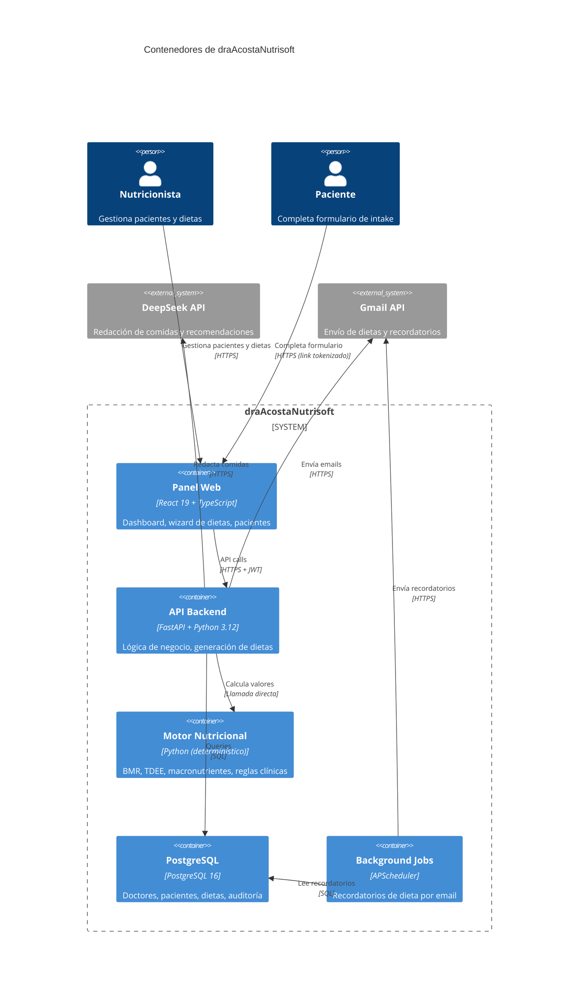
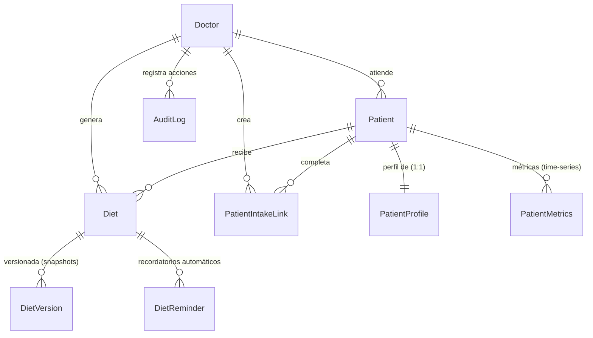

# 🏗️ Architecture: draAcostaNutrisoft

## Diagrama C4 — Nivel Contenedores



---

## Estilo Arquitectónico

**Arquitectura en Capas con Dominio Rico.** El proyecto se organiza en capas concéntricas donde las dependencias fluyen hacia adentro:

```
api/           ← Capa de presentación (routers FastAPI)
services/      ← Capa de aplicación (orquestación de flujos)
logic/         ← Capa de dominio (reglas de negocio puras)
nutrition/     ← 🧬 Motor nutricional (cálculos determinísticos)
models.py      ← Capa de persistencia (modelos SQLAlchemy)
```

**Principio fundamental:** El motor nutricional es 100% determinístico. El LLM **nunca** calcula valores clínicos — solo redacta descripciones de comidas. Los valores del motor **sobrescriben** cualquier valor numérico del LLM en el merge final, garantizando seguridad clínica. Ver [ADR-001](adr/ADR-001-deterministic-engine-over-llm.md).

---

## Flujo de Datos Principal: Generación de Dieta

```
Nutricionista → [POST /api/diets/generate]
  → DietService.generate()
    → input_builder.build(patient, profile, preferences)
      → NutritionInput {
          age, weight, height,
          activity → normalizado (sedentario=1.2, moderado=1.55, activo=1.725, ...),
          goal → normalizado (loss=0.80, maintenance=1.0, muscle_gain=1.12, ...),
          diseases → [diabetes, hypertension, ...]
        }
    → engine.calculate(input)
      → BMR (Mifflin-St Jeor):
           ♂: 10×peso + 6.25×altura - 5×edad + 5
           ♀: 10×peso + 6.25×altura - 5×edad - 161
      → TDEE = BMR × activity_factor
      → Calorie target = TDEE × goal_factor
        → Safety floor: max(1200 ♀, 1500 ♂)
      → Protein: 1.6-2.2 g/kg (soft), max 2.8 g/kg (hard)
        → Renal: ceiling 0.88 g/kg
      → Fats: 25-35% total, dyslipidemia → 0.9x reduction
      → Carbs: remainder
      → Alerts: [LOW_WEIGHT, HIGH_SODIUM, ...]
      → NutritionResult { calories, macros, alerts, schema_version: "1.0" }
    → diet_openai.generate_diet_plan_json(patient_context, engine_result)
      → Sistema prompt con: datos del paciente, target nutricional, patologías
      → LLM genera: desayuno, almuerzo, cena, merienda + recomendaciones
      → Output: structured_plan_json (solo descripciones, no valores)
    → plan_merge.merge(engine_result, llm_plan)
      → Override engine → plan: calories, protein_g, fat_g, carbs_g
      → LLM values descartados, solo se conservan descripciones de comidas
    → Persistir Diet (structured_plan_json) + DietVersion (input/output snapshot)
  → Cliente recibe DietResponse con plan completo
```

---

## Patrones de Diseño

| Patrón | Ubicación | Propósito |
|--------|-----------|-----------|
| **Service Layer** | `services/diet_service.py` | Orquestar generación de dieta completa |
| **Strategy** | `nutrition/engine.py` + `NutritionStrategyMode` | Auto, Guided, Manual |
| **Domain Model Tipado** | `nutrition/contract.py` | Contratos inmutables: NutritionInput, NutritionResult, NutritionAlert |
| **Template Method** | `services/diet_export.py` | PDF: WeasyPrint → ReportLab (fallback automático) |
| **Circuit Breaker** | `core/circuit_breaker.py` | Resiliencia ante fallos de APIs externas (50 errores/60s → 30s cooldown) |
| **Specification** | `logic/diet_eligibility.py`, `logic/profile.py` | Reglas de completitud de perfil y elegibilidad |
| **Observer** | `services/reminder_service.py` | Recordatorios automáticos de dieta vía APScheduler |
| **Factory** | `nutrition/input_builder.py` | Construir NutritionInput desde modelos ORM |

---

## Modelo de Datos Simplificado



---

## Decisiones Clave

| Decisión | ADR | Resumen |
|----------|-----|---------|
| Motor determinístico | [ADR-001](adr/ADR-001-deterministic-engine-over-llm.md) | Cálculos clínicos nunca delegados al LLM |
| Generación de PDFs | [ADR-002](adr/ADR-002-weasyprint-over-chromium.md) | WeasyPrint sobre Chromium para imágenes Docker pequeñas |
| Modelo de tenant | [ADR-003](adr/ADR-003-single-tenant-over-multi-tenant.md) | Single-tenant: un consultorio por instancia |
