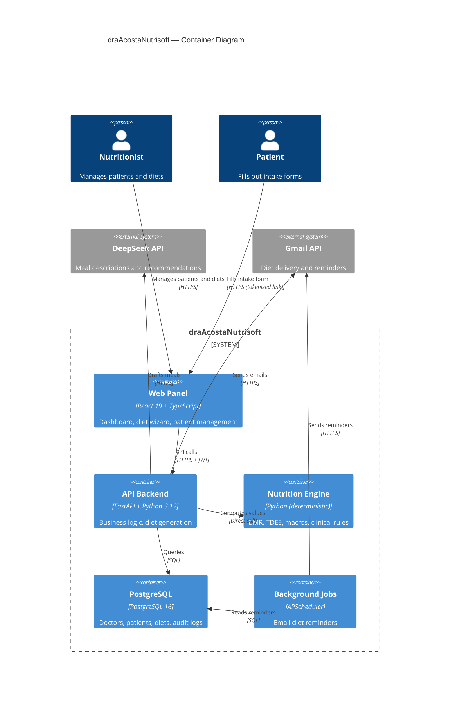
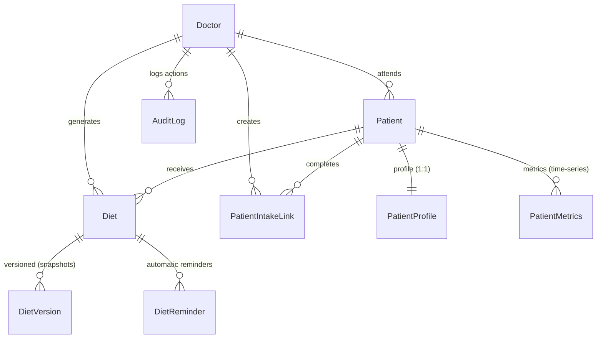

# 🏗️ Architecture: draAcostaNutrisoft

## C4 Container Diagram



---

## Architectural Style

**Layered Architecture with a Rich Domain Model.** The project organizes code into concentric layers where dependencies flow inward:

```
api/           ← Presentation layer (FastAPI routers)
services/      ← Application layer (flow orchestration)
logic/         ← Domain layer (pure business rules)
nutrition/     ← 🧬 Nutrition engine (deterministic calculations)
models.py      ← Persistence layer (SQLAlchemy models)
```

**Core principle:** The nutrition engine is 100% deterministic. The LLM **never** computes clinical values — it only drafts meal descriptions. Engine values **override** any LLM numeric output during the final merge, guaranteeing clinical safety. See [ADR-001](adr/ADR-001-deterministic-engine-over-llm.md).

---

## Main Data Flow: Diet Generation

```
Nutritionist → [POST /api/diets/generate]
  → DietService.generate()
    → input_builder.build(patient, profile, preferences)
      → NutritionInput {
          age, weight, height,
          activity → normalized (sedentary=1.2, moderate=1.55, active=1.725, ...),
          goal → normalized (loss=0.80, maintenance=1.0, muscle_gain=1.12, ...),
          diseases → [diabetes, hypertension, ...]
        }
    → engine.calculate(input)
      → BMR (Mifflin-St Jeor):
           ♂: 10×weight + 6.25×height - 5×age + 5
           ♀: 10×weight + 6.25×height - 5×age - 161
      → TDEE = BMR × activity_factor
      → Calorie target = TDEE × goal_factor
        → Safety floor: max(1200 ♀, 1500 ♂)
      → Protein: 1.6-2.2 g/kg (soft), max 2.8 g/kg (hard)
        → Renal: ceiling 0.88 g/kg
      → Fats: 25-35% total, dyslipidemia → 0.9x reduction
      → Carbs: remainder
      → Alerts: [LOW_WEIGHT, HIGH_SODIUM, ...]
      → NutritionResult { calories, macros, alerts, schema_version: "1.0" }
    → diet_openai.generate_diet_plan_json(patient_context, engine_result)
      → System prompt with: patient data, nutritional targets, pathologies
      → LLM generates: breakfast, lunch, dinner, snack + recommendations
      → Output: structured_plan_json (descriptions only, no values)
    → plan_merge.merge(engine_result, llm_plan)
      → Engine override → plan: calories, protein_g, fat_g, carbs_g
      → LLM numeric values discarded, only meal descriptions preserved
    → Persist Diet (structured_plan_json) + DietVersion (input/output snapshot)
  → Client receives DietResponse with full plan
```

---

## Design Patterns

| Pattern | Location | Purpose |
|---------|----------|---------|
| **Service Layer** | `services/diet_service.py` | Orchestrate full diet generation flow |
| **Strategy** | `nutrition/engine.py` + `NutritionStrategyMode` | Auto, Guided, Manual modes |
| **Typed Domain Model** | `nutrition/contract.py` | Immutable contracts: NutritionInput, NutritionResult, NutritionAlert |
| **Template Method** | `services/diet_export.py` | PDF: WeasyPrint → ReportLab (automatic fallback) |
| **Circuit Breaker** | `core/circuit_breaker.py` | Resilience for external API failures (50 errors/60s → 30s cooldown) |
| **Specification** | `logic/diet_eligibility.py`, `logic/profile.py` | Profile completeness and eligibility rules |
| **Observer** | `services/reminder_service.py` | Automatic diet reminders via APScheduler |
| **Factory** | `nutrition/input_builder.py` | Build NutritionInput from ORM models |

---

## Simplified Data Model



---

## Key Decisions

| Decision | ADR | Summary |
|----------|-----|---------|
| Deterministic engine | [ADR-001](adr/ADR-001-deterministic-engine-over-llm.md) | Clinical calculations never delegated to the LLM |
| PDF generation | [ADR-002](adr/ADR-002-weasyprint-over-chromium.md) | WeasyPrint over Chromium for smaller Docker images |
| Tenant model | [ADR-003](adr/ADR-003-single-tenant-over-multi-tenant.md) | Single-tenant: one clinic per instance |
